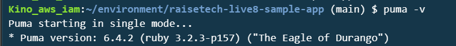
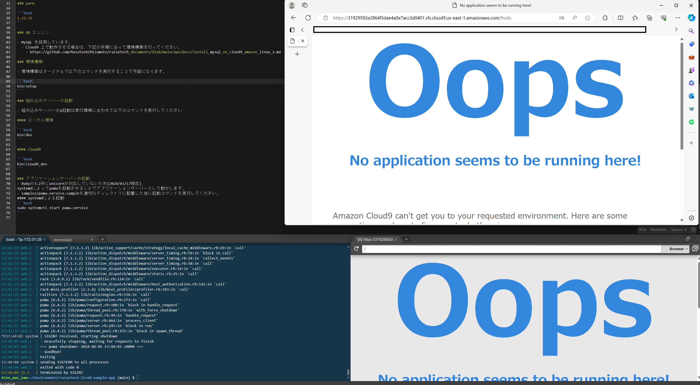
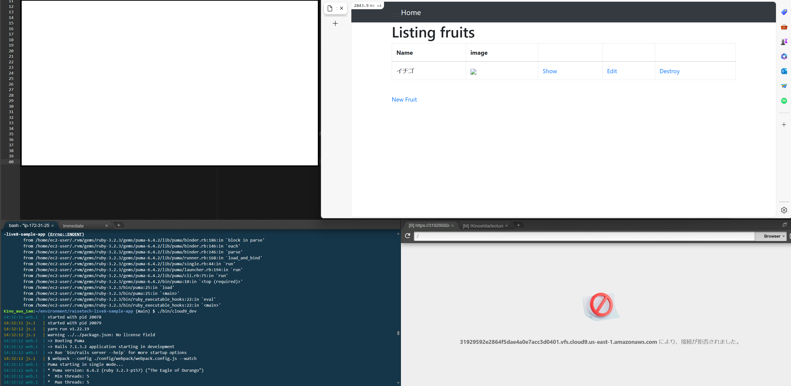
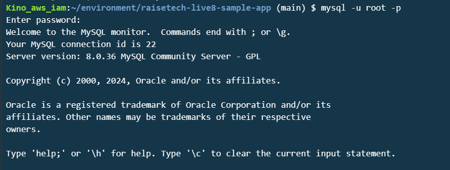
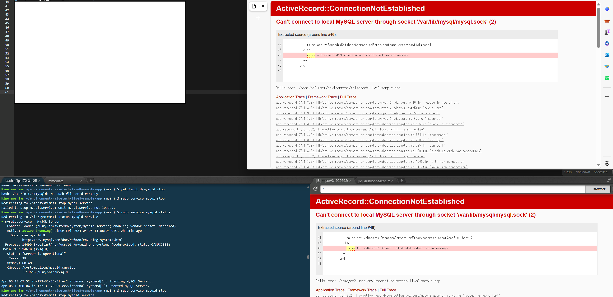

# AWSコース第3回講義の受講

## 概要
1. 第3回講義動画の視聴
2. 課題取り組み

## 課題実施内容

### サンプルアプリケーションの起動
1. サンプルアプリケーションをgithubからクローン
2. rubyのインストール
3. bundlerのインストール
4. nodeのインストール
5. yarnのインストール
6. mysqlのインストール＆初期設定（パスワード変更）
7. railsのインストール＆環境構築（bin/setup実行）
8. 組み込みサーバーの起動（bin/cloud9_dev実行）
9. アプリケーション起動確認＆動作検証

作業時の注意点
* メモリ容量が不足するため増強が必要

最初EBSサイズを17GBに上げるのみ行いrailsのインストールを実施したところ、メモリ容量の警告メッセージが表示された。
それに伴い、インストールが終了せず、サーバーのCPU使用率も高くなってしまい、EC2にアクセスできなくなってしまった。
EC2の作成からやり直すことになったため、インストールするアプリケーションの動作要件を事前にチェックすることが大切と感じた。
今回は、メモリ容量を増設することで解消した。

* yarnパッケージのインストールを忘れないように

組み込みサーバーを起動し、起動確認を行った際にyarnにて「error Command failed with exit code 127.」が表示された。
「yarn install」を実行することで解消した。

* host名の登録

上記yarnパッケージのインストールを実施後、再度起動確認をしたところ、今度はhost名を追加しなければいけない旨のメッセージが表示された。
そこで、自分の環境に表示された「config.hosts」の情報を追記した。

### APサーバーについて調べる

* APサーバーの名前とバージョン：Puma Version 6.4.2

* APサーバーを終了させた場合、引き続きアクセスできるか？

回答：できない

再度APサーバーを起動するとアクセスできるようになった。

### DBサーバーについて調べる

* サンプルアプリケーションで使ったDBサーバー（DBエンジン）の名前とバージョンの確認

DBサーバー：mysql
バージョン：8.0.36

* DBサーバーを終了させた場合、引き続きアクセスできるか？

回答：できない

* Railsの構成管理ツールの名前：Bundler Version 2.3.14

## 感想

今回の課題は、講義の動画視聴から2日かけて取り組んだ。
講義の動画にならって同じ操作を実施しても違うエラーが表示されたため、
そこからは自力で問題解決に取り組んだ。
エラー内容をもとに調査を実施したが、インターネット上に同じようなエラーで悩んでいる方もたくさんいて、とても参考になった。
エラー内容、インターネットで調べることの大切さが改めて感じることができました。

また、今回は導入までの流れが講義で説明があったため環境構築ができたが、
今後は１から作る必要があるため、より深い理解が必要だと痛感しました。