# AWSコース第3回講義の受講

## 概要
1. 第4回講義動画の視聴
2. 課題取り組み

## 課題実施内容

### AWS上に新しくVPCを作成する
1. Web管理画面から設定を行う

今回は基本的にデフォルトの設定から変更はしなかった。
サブネットが/16であったため、今後業務を行う上で設定する場合は、
システム要件を考慮して考える必要があると感じました。

* VPC設定画像

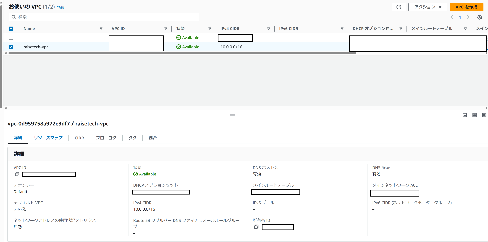

### AWS上に新しくEC2を作成する
1. Web管理画面から設定を行う

セキュリティグループは、Raisetech_WebServer という名前で作成しており、
インバウンド設定でSSHの通信をどこからでもできるようにしているのと、アウトバウンド設定ですべての通信を許可している。

* EC2設定画像

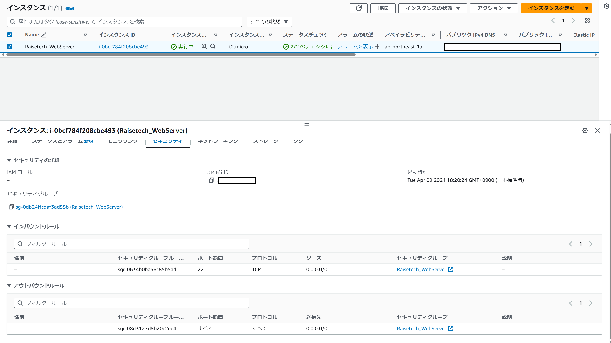

### AWS上に新しくRDSを作成する
1. RDS用のセキュリティグループを作成（Raisetech_WebServer セキュリティグループからのmysql通信を許可）
2. RDS用のサブネットグループを作成（プライベートサブネットに建てられるように設定）
3. RDS用オプショングループを作成（DBエンジンとメジャーバージョンの指定）
4. Web管理画面からRDSの設定構築

* RDS設定画面一式

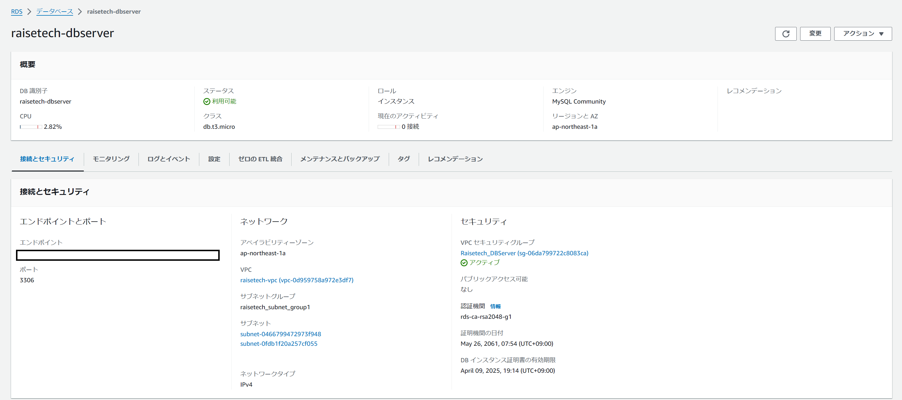

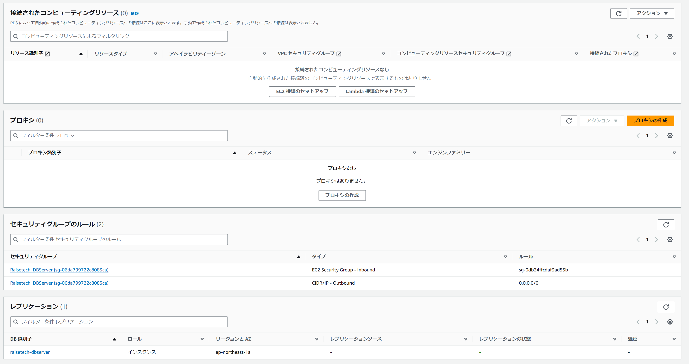

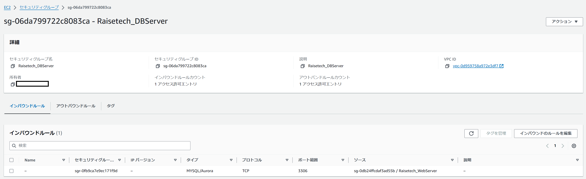

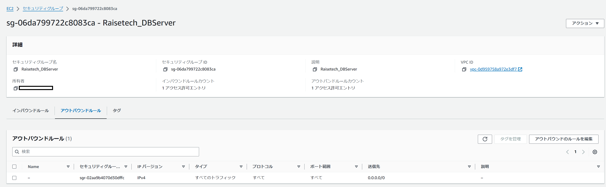

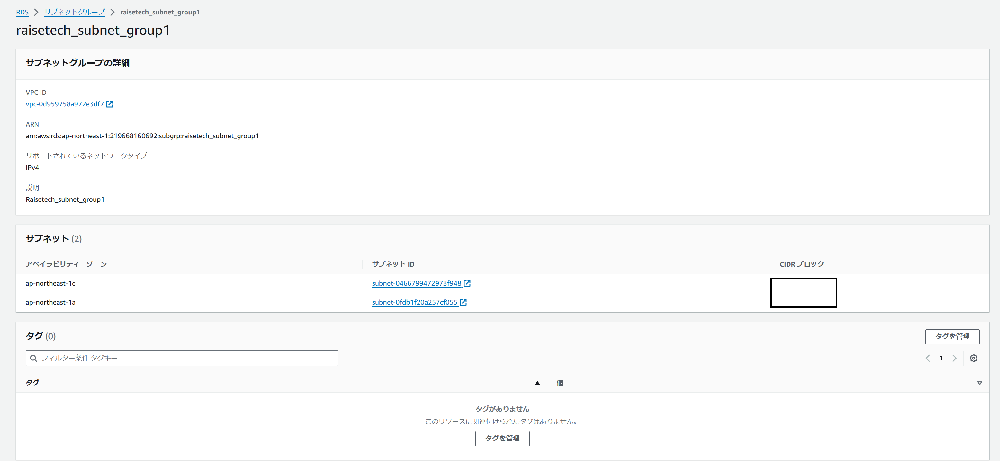

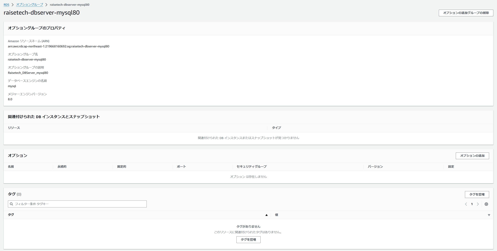

### 構築したEC2とRDSに接続できるか確認する

今回は、接続確認を実施するために、RLoginというツールを使用しました。
初期設定として、サーバのパブリックIPアドレスの登録、アクセスユーザーの登録（ec2-user）、キーペアの登録、通信設定（SSH）などを行っています。

* 接続テスト結果

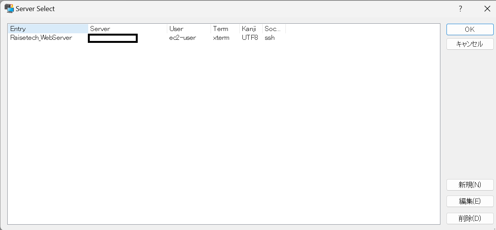

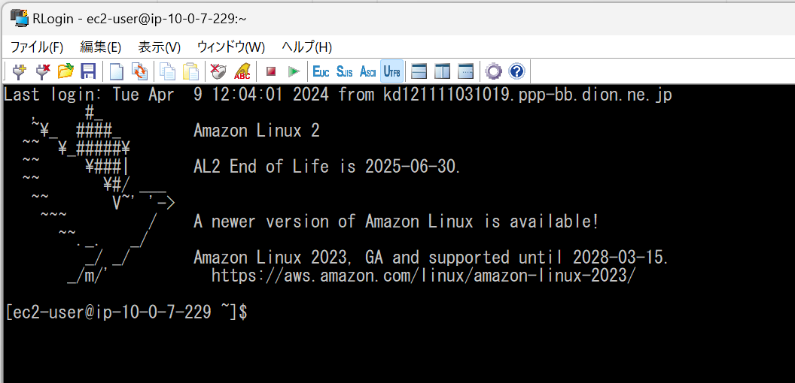

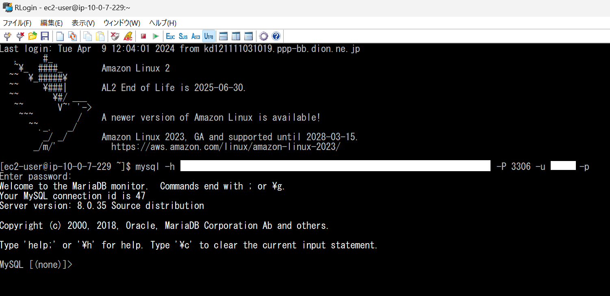

## 感想

実際にVPCの環境を構築してみた感想として、
とても楽にネットワーク環境を構築できるなと感じました。
逆に構造を理解していなければ、どのような環境になっているかの判断が難しいとも思いました。
私は現職でもある程度ネットワーク構築の経験をさせていただいたため、スッと頭に入ってきました。
経験が役になってよかったです。